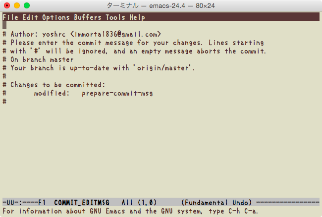

# git-show-author-hook

A git hook to show author when editing commit message.

## Requirement

- python

## Installation

Drop `prepare-commit-msg` into git template hook directory.

    mkdir -p ~/.git_template/hooks
    cp path/to/prepare-commit-msg ~/.git_template/hooks/
    git config --global init.template ~/.git_template

Then `git init` in your git projects. Even in existing projects, `git init` is no problem.

After the setup above, this hook turns enable whenever you `git init` or `git clone`.
